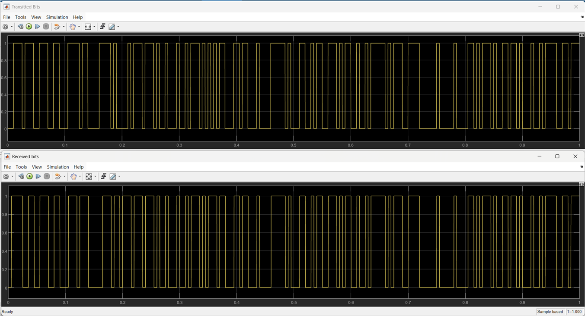
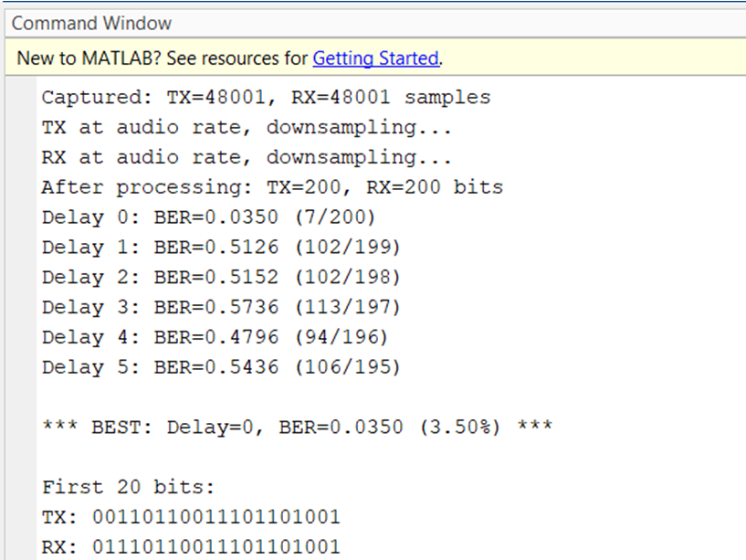

# Underwater Acoustic Communication using BFSK

## Overview

This project presents the design and simulation of an **Underwater Acoustic Digital Communication System** using **Binary Frequency Shift Keying (BFSK)**. The system is implemented in **MATLAB and Simulink**, incorporating realistic underwater channel effects and performance evaluation using Bit Error Rate (BER) analysis.

The receiver employs a **Goertzel-based frequency detector** for reliable demodulation of BFSK signals in noisy and fading underwater environments.

---

## System Architecture

The complete communication system consists of the following blocks:

* **BFSK Transmitter**

  * Binary data generation
  * Frequency mapping for BFSK modulation
* **Underwater Acoustic Channel**

  * Rician fading (multipath effects)
  * Additive White Gaussian Noise (AWGN)
* **BFSK Receiver**

  * Bandpass filtering
  * Automatic Gain Control (AGC)
  * Frequency detection using Goertzel algorithm
* **Performance Evaluation**

  * Bit Error Rate (BER) computation
  * Delay-based synchronization analysis

---

## Key Features

* Binary Frequency Shift Keying (BFSK) modulation
* Realistic underwater acoustic channel modeling
* Rician multipath fading simulation
* AWGN noise analysis
* Bandpass filtering and AGC at the receiver
* **Goertzel-based frequency detection**
* BER analysis under different delays and SNR conditions
* Sample-by-sample real-time bit detection

---

## Goertzel-Based FSK Detector

The BFSK receiver uses a **custom MATLAB implementation of the Goertzel algorithm** for frequency detection.

**Detected Frequencies:**

* `600 Hz` → Bit `0`
* `1100 Hz` → Bit `1`

**Key Parameters:**

* Sampling frequency: `100 kHz`
* Bit duration: `4 ms`
* Samples per bit: `400`

**Detector Outputs:**

* Detected bit (`0` or `1`)
* Energy at both BFSK frequencies
* Decision validity flag for synchronization

The detector operates in a **sample-by-sample manner**, making it suitable for real-time underwater communication systems.

---

## Simulation Tools

* **MATLAB**
* **Simulink**

---

## Simulation Results

1️⃣ Transmitted and Received Bit Comparison

The following simulation shows the comparison between transmitted BFSK bits and the received bits after passing through the underwater acoustic channel.

Top plot   : Transmitted bits

Bottom plot: Received bits

✔ Shows correct demodulation using frequency detection.

2️⃣ Goertzel-Based Frequency Detection

Frequency detection is implemented using a sample-by-sample Goertzel algorithm, avoiding external buffers and ensuring real-time compatibility.

Key Observations:

Energy at target frequencies (600 Hz & 1100 Hz)

Bit decision based on dominant frequency

Optimal delay selected using BER minimization

3️⃣ Bit Error Rate (BER) Analysis

BER is computed by comparing transmitted and received bit streams under different delays and channel conditions.

Best performance achieved at:

Delay = 0

BER ≈ 3.5%

🧠 Receiver Algorithm (Core Logic)

The BFSK receiver uses a Goertzel-based detector implemented in MATLAB:

📁 src/goertzel_fsk_detector.m

Key features:

Persistent buffering (400 samples / bit)

Dual-frequency energy comparison

Decision validity flag for symbol synchronization

## Applications

* Underwater sensor networks
* Oceanographic data transmission
* Marine monitoring systems
* Defense and submarine communications
* Low-data-rate underwater telemetry

## Implementation Notes
- Detector implemented as a sample-by-sample Goertzel algorithm
- Suitable for real-time underwater acoustic receivers
- Can be extended to MFSK or adaptive threshold detection

 ## How to Run
1. Open the Simulink model in MATLAB
2. Ensure `src/` is added to MATLAB path
3. Run simulation
4. Observe transmitted/received bits and BER

